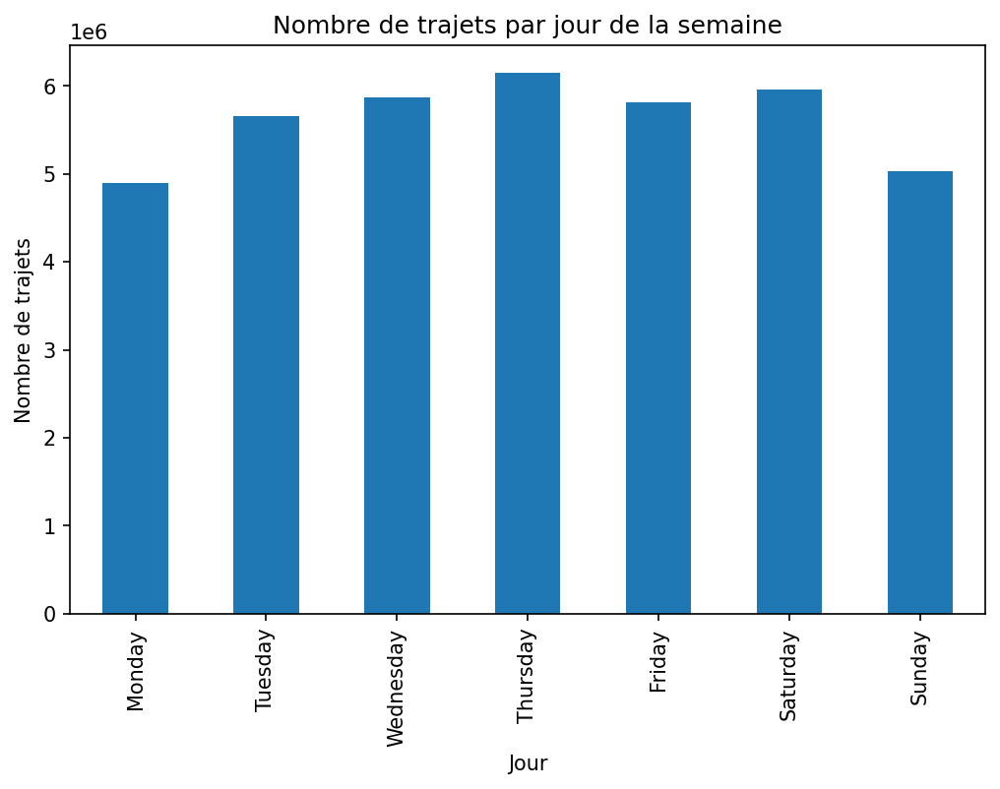
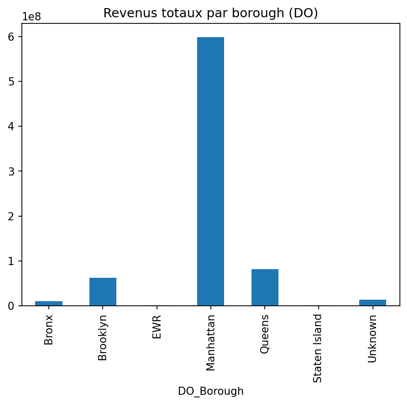
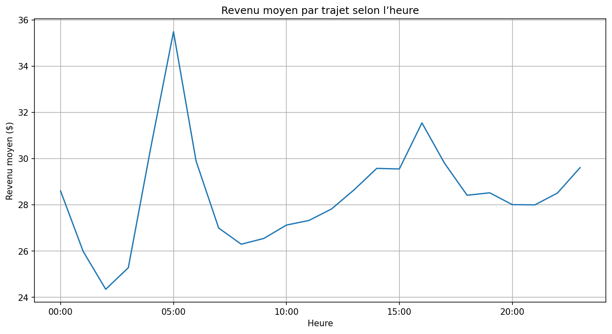
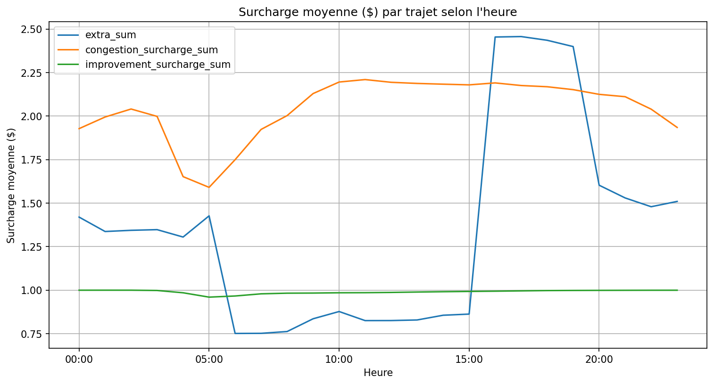

## 📌 Description
Ce projet propose une **analyse exploratoire des taxis jaunes de New York (2024)** à partir de données agrégées (trajets, revenus, surcharges).  
L’objectif est d’identifier les **dynamiques spatiales et temporelles** qui influencent l’activité et la rentabilité des trajets.  

Réalisé en **Python** avec `pandas`, `matplotlib` et `seaborn`.

---

## 🎯 Objectifs
- Comprendre **où et quand** les trajets sont les plus fréquents.  
- Comparer la **rentabilité des zones** (Manhattan vs aéroports).  
- Étudier les **variations temporelles** (jours, heures).  
- Évaluer l’impact des **surcharges** (extra, congestion).  

---

## 📊 Aperçu des résultats

### Trajets par jour de la semaine


### Trajets par borough


### Revenu moyen par heure


### Impact des surcharges


## 📂 Structure du repo

```
nyc-taxi-analysis/
├── notebooks/
│ └── Analyse_Taxi_NYC.ipynb                            # Notebook principal
│
├── figures/                                            # Graphiques exportés
│ ├── Revenu_moyen_par_trajet_selon_le_borough.png
│ ├── Revenus_totaux_par_borough.png
│ ├── Revenu_moyen_par_trajet_selon_l_heure.png
│ ├── Nombre_de_trajets_vs_Revenu_moyen_par_heure.png
│ ├── Durée_moyenne_d1_trajet_selon_l_heure.png
| ├── Surcharge_moyenne_par_trajet_selon_l_heure.png
| ├── trajets_par_heure_de_la_journée.png
| ├── trajets_par_jour.png
| ├── trajets_par_jour_de_la_semaine.png
| ├── Trajets_semaine_vs_week-end.png
| ├── Volume_vs_Rentabilité_par_borough_DO.png
| └── Volume_vs_Rentabilité_par_borough_PU.png
|
├── README.md                                           # Présentation du projet
├── requirements.txt # Librairies nécessaires
└── .gitignore                                          # Exclusion de data/checkpoints
